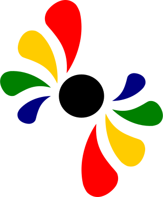

# Chromaticity
### By Robbie Neville

Chromaticity is a simple color picker and palette app made with React! 
It is indented to be used for discovering and compiling collections 
of colors for use in Web design and graphic art. It has a simple 
intuitive interface that enables you to find colors using a custom built
color picker. If you stumble across one that you like, you can add 
it to your favourites or even create a palette and save it for later!
Palettes are useful for grouping together related colors. You can easily 
rename or delete a palette, or remove colors from a palette/favorites 
using context menus!

This Chromaticity is currently deployed at 
[https://r-neville.github.io/chromaticity/](https://r-neville.github.io/chromaticity/). 
Check it out!

## Data Persistence

Chromaticity does not send any information from its users to a server - 
it relies on local storage to keep a record of the user's palettes, their
favorites, and (as you'll notice) the color picker's state.